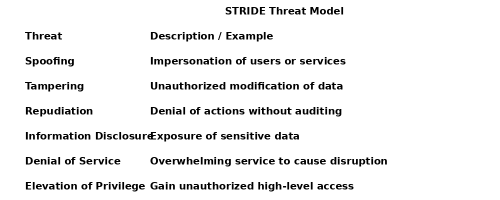

# Compliance & Framework Alignment

This audit aligns with the NIST Cybersecurity Framework (CSF):

- **Identify:** Gaps in asset management and classification.
- **Protect:** Issues with encryption, access control, and password management.
- **Detect:** Lack of an IDS/IPS and log monitoring systems.
- **Respond/Recover:** No established disaster recovery procedures.

**Compliance Checklists:**  
- **PCI DSS:** Inadequate controls for securing credit card data.  
- **GDPR:** Partial adherence; customer data is largely secure but lacks proper classification.  
- **SOC (Type 1 & 2):** User access policies and data confidentiality issues identified.

## 🧱 Threat Model – STRIDE

The following diagram outlines the six primary threat categories defined by STRIDE:

